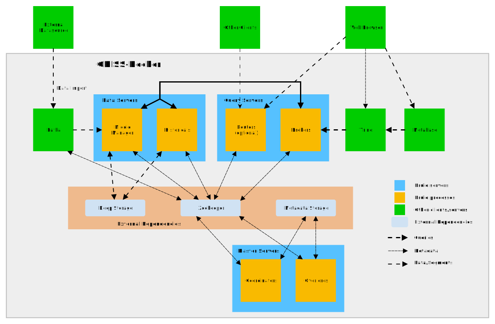

# Architecture

 * [Apache Druid (Data Warehouse)](#apache-druid-data-warehouse)
   * [Master Servers](#master-servers)
   * [Data Servers](#data-servers)
   * [Query Servers](#query-servers)
* [Apache Kafka (Data Ingestion)](#apache-kafka-data-ingestion)
* [Apache Kafka (Data Ingestion)](#metabasetrino-data-querying)

 

## Apache Druid (Data Warehouse)

Apache Druid is a real-time database to power modern analytics applications.
In ODISS-Docker it is use for saving data in a table format.

It is seperated into three servers. Each server contains two subsystems.
The subsystems are seperated into different task to work independent. If a subsystem
crashes, the other subsystems are not effected.

Apache ZooKeeper is used for sharing and handling temporary metadata in between the
subsystems.
The remaining metadata is saved in a seperated Database. For example this includes
the paths to the segments locations and the ingestion options from Apache Kafka.

The Deep Storage is only used by the Data Servers. The segments are backed up in
'.zip' files on a local hard drive.

### Master Servers

A Master server manages data ingestion and availability: it is responsible for
starting new ingestion jobs and coordinating availability of data on the
"Data servers" described below.

Within a Master server, functionality is split between two processes, the
Coordinator and Overlord.

### Data Servers

A Data server executes ingestion jobs and stores queryable data.

Within a Data server, functionality is split between two processes, the
Historical and MiddleManager.

### Query Servers

A Query server provides the endpoints that users and client applications
interact with, routing queries to Data servers or other Query servers (and
optionally proxied Master server requests as well).

Within a Query server, functionality is split between two processes, the
Broker and Router.
The Router can be accessed over a [web browser](./GETTING_STARTED.md#apache-druid-console).
The Broker can be [accessed over different clients directly](./GETTING_STARTED.md#how-to-access-the-data-from-external-clients) to load data.

## Apache Kafka (Data Ingestion)

Apache Kafka is an event streaming platform for high-performance data
pipelines, streaming analytics, data integration, and mission-critical
applications.

In ODISS-Docker it is used for the data ingestion into Apache Druid. Kafka
provides two listeners for accessing data pipelines.

1. The external listener is used by external client to ingest data into
   ODISS-Docker. The authentication is based on a certificate and a basic
   authentication. There are many [clients](https://cwiki.apache.org/confluence/display/KAFKA/Clients)
   that can be used for [ingesting data](./GETTING_STARTED.md#load-data-into-kafka).

2. The internal listener is used by Apache Druid to [ingest the data into the
   Data Warehouse](./GETTING_STARTED.md#load-data-from-kafka-into-druid). The internal
   authentication is only based on basic auth but is only accessible from
   defined docker network.

## Metabase/Trino (Data Querying)

Metabase is a simple and powerful analytics tool. It can be accessed over a web
browser. From Metabase you can only read the data, you are not able to change it.

In ODISS-Docker its is used to analyse the data saved in Apache Druid.
Trino has to be used as a middleware, since Metabase does not provide a driver
that can use join operations yet. Trino provides a web browser based user interface
to monitor the queries directed from Apache Metabase to Apache Druid.