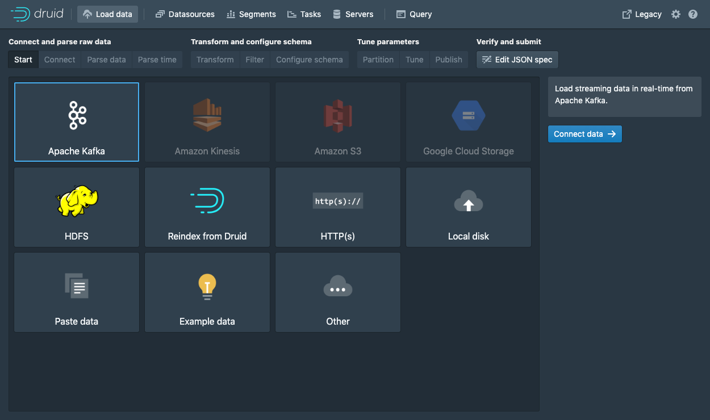
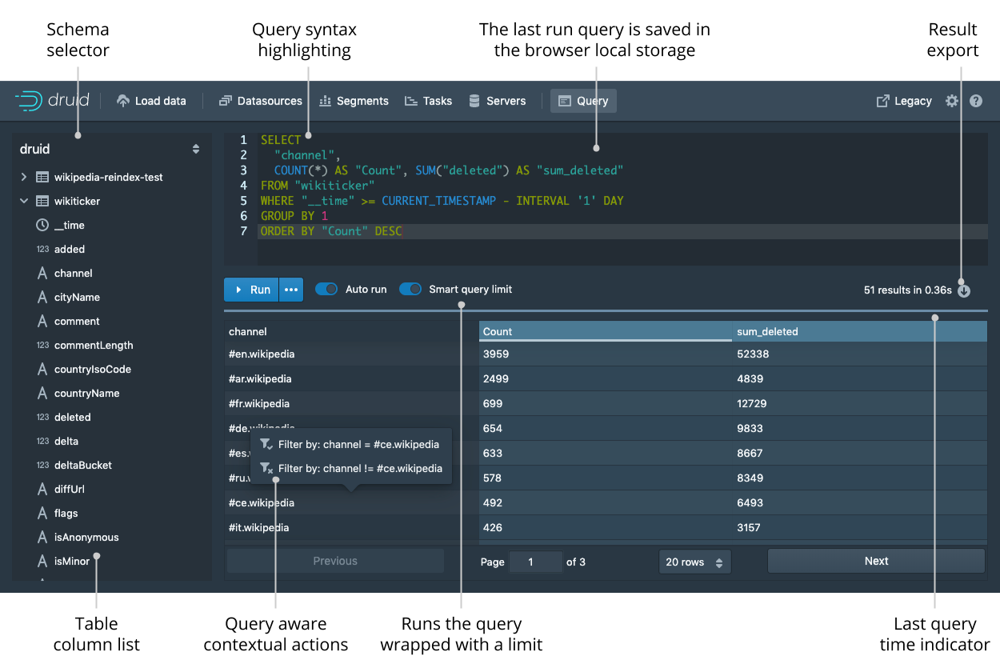

# Getting started

## Table of contents

 * [Introduction](#introduction)
 * [Managing Single-Server](#managing-single-server)
   * [Starting Single-Server](#starting-single-server)
   * [Stopping Single-Server](#stopping-single-server)
   * [Backup/Restoring Single-Server](#backuprestoring)
 * [Apache Druid](#apache-druid)
 * [Apache Metabase](#apache-metabase)
   * [Create a common user account](#create-a-common-user-account)
 * [Load Data into Kafka (Example: Java)](#load-data-into-odiss-example-java)
   * [Maven dependency](#maven-dependency)
   * [Kafka Client Properties](#kafka-client-properties)
   * [Data Formats](#data-formats)
   * [Java Example Script](#java-example-script)
 * [Load Data (from Kafka into Druid)](#load-data-from-kafka-into-druid)
 * [How to access the Data from external Clients](#how-to-access-the-data-from-external-clients)
    * [JDBC-Driver](#jdbc-driver)
    * [HTTP POST Requests (in R)](#http-post-requests-in-r)
    * [Publish Questions in Metabase](#publish-questions-in-metabase)
 * [How to access the Data using internal Tools](#how-to-access-the-data-using-internal-tools)
   * [Apache Druid Console](#apache-druid-console)

## Introduction

The following tutorials will only scratch the surface of what you are able to do with this project. Each program has its
own documentation, to which is linked below.

* Apache Druid: https://druid.apache.org/docs/latest/design/index.html
* Apache Kafka: https://kafka.apache.org/documentation/
* Apache Metabase: https://www.metabase.com/docs/latest/
* Trino: https://trino.io/docs/current/

The following sections describe functions for the admin or data manager who has access to all sub-programs (Druid, Metabase, Trino, Kafka).
There is only one account since no user management tool is connected yet. Only Metabase provides an internal
user management, but it also has only on admin account. All admin accounts are defined in the 
[environment properties](../env/dev.properties). For more details regarding the configuration variables 
take a look at the [configuration documentation](./CONFIGURATION.md).

Apache Druid router can be accessed over the `www.example.com` and Trino 
can be accessed over `www.example.com/trino/`. Both links are printed out after running the
[setup.sh script](./INSTALLATION.md).

## Managing Single-Server

Since ODISS-Docker is Docker based you can just use the standard
[docker](https://docs.docker.com/engine/reference/commandline/docker/) and
[docker compose](https://docs.docker.com/compose/reference/) commands.

### Starting Single-Server

```
docker-compose start
```

### Stopping Single-Server

```
docker-compose stop
```

### Backup/Restoring

Take a look at the [Backup/Restoring documentation](./BACKUP_RESTORING.md).

## Apache Druid

The Apache Druid Web Console provides a general overview over the datasource's, 
ingestion tasks and allows to graphically configure a new ingestion task from Apache Kafka.
For more information use the [official Web Console tutorial](https://druid.apache.org/docs/latest/operations/druid-console.html).

The Apache Druid admin username is **admin** and
the password is the `ODISS_DRUID_ADMIN_PASSWORD` variable configured in the [environment properties](../env/dev.properties).

For more information about how to use Apache Druid take a look at the 
[Apache Druid documentation](https://druid.apache.org/docs/latest/design/).

## Apache Metabase

The Apache Metabase website is hosted under `www.example.com/metabase`. You have to replace 
www.example.com with your `ODISS_SERVER_NAME` from the [environment properties](../env/dev.properties).

### Create a common user account

Since common users only use Metabase you only have to create a new Metabase account
for them. The [official Metabase tutorial](https://www.metabase.com/docs/latest/administration-guide/04-managing-users.html)
also shows you how to manage users and groups.

For more information about how to use Apache Metabase take a look at the [GETTING_STARTED Guide](./GETTING_STARTED_COMMON_USER.md)
or the [Apache Metabase documentation](https://www.metabase.com/docs/latest/).

## Load Data into ODISS (Example: Java)

Apache Kafka provides multiple client sided APIs like Java, C/C++ or Python. The following part will **only** show 
how to ingest data with the Java Api into Kafka. For other client sided APIs take a look [here](https://cwiki.apache.org/confluence/display/KAFKA/Clients).

Kafka provides a [Java API](https://kafka.apache.org/documentation/#api) which can be added to every Java project with Maven.
You just have to add the maven dependencies.

### Maven dependency

```
<dependency>
   <groupId>org.apache.kafka</groupId>
   <artifactId>kafka-clients</artifactId>
   <version>3.1.0</version>
</dependency>
```

Since this tutorial is about loading data into Kafka the following section
will only describe how to use the [Java Producer API](https://kafka.apache.org/documentation/#producerapi).

Independent of the import method it is necessary to use the right Kafka client properties. Kafka is set up so that you
have to authenticate via **SSL_SASL**. The connection is also encrypted over TLSv1.2. For more details on the architecture
take a look at the [architecture section](./ARCHITECTURE.md).
Therefore, the Kafka Client JAAS config and the Kafka Truststore is needed to establish the connection.

### Kafka Client Properties

The Kafka Client properties can look like the following: `kafka.client.properties`. You only have to replace
the variables from the [environment properties](../env/dev.properties).
There is also an automatic generated [kafka.client.properties](../config/kafka/kafka.client.properties) 
which is already adjusted to Kafka based on the [environment properties](../env/dev.properties).

```
# Standard Kafka config to connect to a Kafka server as a Client
# Authentication is over SSL_SASL
# The encryption is over TLSv1.2

# The Kafka connection URL
bootstrap.servers=${ODISS_SERVER_NAME}:9093

###############
# SASL config #
###############

sasl.mechanism=PLAIN
security.protocol=SASL_SSL
ssl.protocol=TLSv1.2
sasl.jaas.config=org.apache.kafka.common.security.plain.PlainLoginModule required \
   serviceName="kafka" \
   username="${ODISS_KAFKA_KAFKASERVER_USERNAME}" \
   password="${ODISS_KAFKA_KAFKASERVER_PASSWORD}";


##############
# SSL config #
##############

ssl.truststore.location=path/to/kafka/truststore/location/${ODISS_KAFKA_TRUSTSTORE_FILE_NAME}
ssl.truststore.password=kafka_truststore_password

# If you are using a self signed certificate you have to add these config so that Kafka does not validate the certificate
enable.ssl.certificate.verification=false
ssl.endpoint.identification.algorithm=


##############################
# Kafka Stream design config #
##############################

default.key.serde=org.apache.kafka.common.serialization.Serdes$StringSerde
default.value.serde=org.apache.kafka.common.serialization.Serdes$StringSerde
value.serializer=org.apache.kafka.common.serialization.StringSerializer
key.serializer=org.apache.kafka.common.serialization.IntegerSerializer
```

### Data Formats

Java method to integrate/import a JSONArray in a Kafka Topic. The JSONObjects in the JSONArray are not allowed to holder
deeper JSON structure like another JSONArray. It is only allowed to look like the following example:

`{"Username":"Admin","Password":"admin_password","Age":34,"UserGroup":"AdminGroup"}`

You can always adjust your import format, but it has to be a
supported [data format](https://druid.apache.org/docs/latest/ingestion/data-formats.html) by Druid. Since the script is
using JSONArrays you have to add the `org.json` dependency.

```
<dependency>
   <groupId>org.json</groupId>
   <artifactId>json</artifactId>
   <version>20210307</version>
</dependency>
```


### Java Example Script

The following method creates a KafkaProducer with the `properties` loaded from
the [Kafka Client properties](#kafka-client-properties). Then it sends a ProducerRecord for each entry in the JSONArray.
Each ProducerRecord has its own key which is `value.hashCode()` in this example and the value is the JSONObject as a
String. In result the Kafka stream with the Topic name `streamTopicName` holds the data from the JSONArray in a valid
format that can be interpreted by Druid.

```
public void integrateIntoStream(String streamTopicName, JSONArray data) {
   final Properties properties = new Properties();
   
   // Load the Kafka Client propeties: here from the Resource folder as a InputStream.
   properties.load(KafkaStreamIntegrator.class.getResourceAsStream("/kafka.client.properties"));

   Producer<Integer, String> producer = new KafkaProducer<>(properties);
   
   IntStream.range(0, data.length())
          .mapToObj(data::getJSONObject)
          .forEach(value -> producer.send(
                  new ProducerRecord<>(streamTopicName, value.hashCode(), value.toString())
          ));
   producer.close();
}
```


## Load Data (from Kafka into Druid)

The following section explains how you can import the just filled Kafka Stream into Druid by using the Druid Console.

Apache Druid is your Data Warehouse which holds all the data in segments. The data is imported over Ingestion specs
which define how Druid reads and stores it. You can write ingestion specs by hand. Or you can use the data loader. The
following section describes how you can define the Ingestion specs for a Kafka stream Ingestion. Other Ingestion methods
are described in the [Druid documentation](https://druid.apache.org/docs/latest/design/index.html).

This tutorial will refer to
the [official Druid tutorial](https://druid.apache.org/docs/latest/tutorials/tutorial-kafka.html#loading-data-with-the-data-loader)
and adjust their tutorial to this project.

1. Navigate to the Druid Console under `https://example.com/`. Replace `example.com` with your `ODISS_SERVER_NAME`.
   And click on `load data` in the top left corner.



2. After choosing Apache Kafka as the Ingestion method and clicking on "Connect data" you have to adjust the connection
   parameters.


On the right side you have to configure the [Kafka Topic](https://kafka.apache.org/intro) which is essentially the stream
ID from which you would like to import your data from. Since Kafka is secured by authentication you have to adjust
the `Consumer properties`. You can find a generated [consumer_properties.txt](../config/druid/consumer_properties.txt) file which is already adjusted to 
Kafka based on the [environment properties](../env/dev.properties). Just copy the content into the `Consumer properties`
part on teh right side.

After clicking "Apply" Druid tries to establish the connection to Kafka with the given authentication config. If you
have adjusted your Kafka Jaas config the `Consumer properties` may differ.

3. When the connection to the [Kafka Topic](https://kafka.apache.org/intro) is made you should already see you unparsed
   data. Once the data is located, you can click "Next: Parse data" to go to the next step.

4. The following steps does not differ from
   the [official Druid tutorial](https://druid.apache.org/docs/latest/tutorials/tutorial-kafka.html#loading-data-with-the-data-loader)
   . Therefore, just follow the Druid tutorial from the third step (Parse data).


## How to access the Data from external Clients

There are APIs in Druid or Metabase to load the data into external programs.
(Suggestion: Use the Druid APIs since they directly access the data, and you do not have to publish your data publicly.)

Druid has a Python API called [pydruid](https://github.com/druid-io/pydruid) and a R API
called [RDruid](https://github.com/druid-io/RDruid), but they are both not supported anymore. </br>
Druid also provides a [HTTP API](https://druid.apache.org/docs/latest/operations/api-reference.html) which allows
complete control about managing the data. To query the data with SQL you can connect to the Avatica JDBC driver
interface. There is a [complete documentation](https://druid.apache.org/docs/latest/querying/sql.html#jdbc) on how to
connect to the interface. The only thing that differ is the URL. First, you can only access it over HTTPS and you have
to add your basic auth credentials. It should look something like the following. Only replace the variables with
definition from the [environment properties](../env/dev.properties).

### JDBC-Driver

```
jdbc:avatica:remote:url=https://admin:${ODISS_DRUID_ADMIN_PASSWORD}@${ODISS_SERVER_NAME}/druid/v2/sql/avatica/
```

### HTTP POST Requests (in R)

You can also query the data over [HTTP POST requests](https://druid.apache.org/docs/latest/querying/sql.html#http-post)
if you are not able to use the JDBC driver. In R you can get and parse the data with the following script. You need to
install the 3 libraries imported at the top of the script. The request URL is very similar to the URL for the JDBC
driver. here you also have to replace the variables with definition from the [environment properties](../env/dev.properties).

```
library(tidyverse)
library(httr)
library(jsonlite)

data <- POST(
  'https://admin:${ODISS_DRUID_ADMIN_PASSWORD}@${ODISS_SERVER_NAME}/druid/v2/sql/',
  body = list(query = 'SELECT * FROM INFORMATION_SCHEMA.TABLES'),
  config = httr::config(ssl_verifypeer = FALSE),
  encode = 'json'
) %>%
  content(as = 'text', encoding = 'UTF-8') %>%
  fromJSON()
```

### Publish Questions in Metabase

In Metabase you can define [Questions](https://www.metabase.com/docs/latest/users-guide/04-asking-questions.html) (SQL
Queries) and save them. To access the results you have
to [publish the question](https://www.metabase.com/docs/latest/administration-guide/12-public-links.html). This returns
a URL with a generated ID for that question. Over the URL you can get the data with a HTTP get request.
**But this URL is not secured over authentication, so it is publicly accessible if you have the question ID.**

## How to access the Data using internal Tools

You can query the data using Metabase or
the [Druid Console](https://druid.apache.org/docs/latest/operations/druid-console.html).
(Suggestion: Use Metabase instead of the Druid console, as Metabase is designed to query, manage and combine queries
into dashboards.)

<a name="getting_started_access_data_external_druid_console"></a>
### Apache Druid Console

The Druid Console looks like the following and is an easy tool for simple SQL queries.



